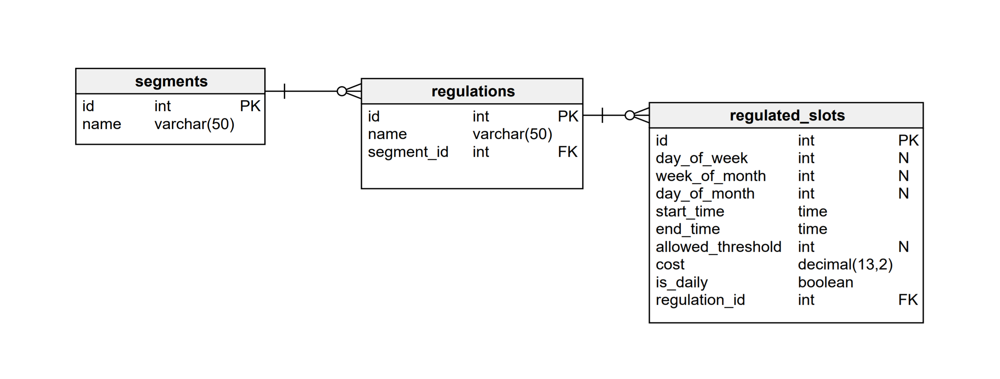

# SpotAngels DB Architecture

For this task, I chose to use a relational database and create 3 tables.

- `segment`: This table will store the segments' information. I am only storing the name and ID here, since the segment will already be matched with the spot beforehand.
- `regulation`: This table will store the regulation's information. I am storing the name of the regulation and `segment_id` in here. We could store segment names as enums for scaling purposes.
- `regulated_slot`: This table will store the regulated slot's information. This contains the time and date of the regulation and regulation's ID.



This DB Model Architecture will allow us to map the issues at task to the database. For example, if regulation for a segment is "Streat Cleaning" from 9 AM to 11 AM on every 2nd and 4th Friday of the month, we can easily map this information as such

    segment = (id=1, name="Castro St")
    regulation = (id=1, segment_id=1, name="Streat Cleaning")
    regulated_slot = (id=1, regulation_id=1, day_of_week=5, week_of_month=2, start_time="9:00", end_time="11:00")
    regulated_slot = (id=2, regulation_id=1, day_of_week=5, week_of_month=4, start_time="9:00", end_time="11:00")

Another example of "Meter" regulation where someone can park for a price of 5$/hour from 8 AM to 6 PM daily, and has the time limitation of 2 hours at max can be mapped like this

    segment = (id=2, name="Market St")
    regulation = (id=2, segment_id=2, name="Meter")
    regulated_slot = (id=3, regulation_id=2, is_daily=true, start_time="8:00", end_time="18:00", allowed_threshold=2, cost=5)

## Improvements

While this solution works for the problem at hand, we could improve upon this solution further to impose certain constraints on the data. We could use different tables for different kinds of regulations and enforce constraints that are much better suited for that particular regulation. For example, the `Meter` regulation will always have a price, so we can enforce that in the `Meter`'s `regulated_slot` table.

# How to Run
I have included a `db_create.sql` script for database creation and `demo_data.sql` for demo data to test the API. Also included `Dockerfile` and `docker-compose.yml` to run everything at once. To run everything at once just run

```bash
docker-compose up
```

After that there's just one API to hit `http://localhost:8080/api/regulation?segment_id=1&timestamp=1629207385`

It will return the active regulations of that timestamp for that segment. If there is a regulation that trumps all other, it will be returnred as `high_priority`.
While for this task I am only handling active regulation for a timestamp, it doesn't handle the extra parts like, what is the next active regulation and when that starts which could be the next step for improvement.
